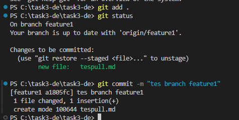
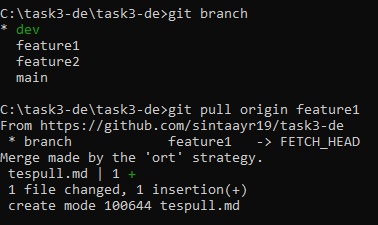
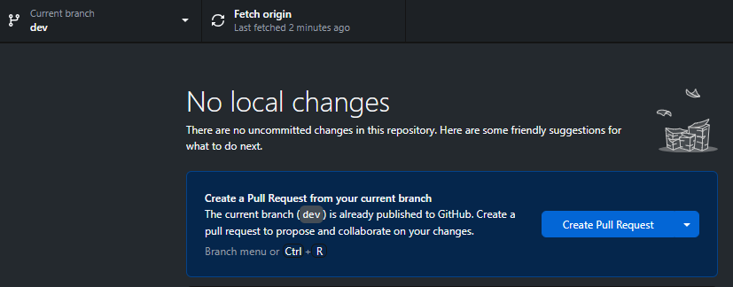

## Prioritas 1
- buatlah sebuah repository github yang sesuai dengan namaKelas_namaKalian.

  

- buatlah folder yang berurutan dan diberi nama sesuai dengan nama soal yang kalian kerjakan.

  

  

  

## Proritas 2
langkah-langkah yang saya lakukan :
- membuat branch dev di dalam branch main
- membuat branch feature1 dan feature2 di dalam branch dev
- menambahkan file baru pada branch feature1

  

- melakukan git pull origin feature1 pada branch dev

  

setelahnya akan muncul pesan untuk melakukan pull request seperti berikut :

  

- Untuk itu, saya melakukan merge untuk update ke branch main

  

branch main telah terupdate
