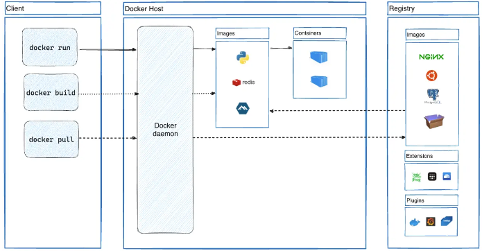

SUMMARY - DOCKER

### Container VS Virtual Machine
| Container | Virtual Machine |
| --------- | --------------- |
| Sebuah unit yang membungkus kode beserta dependensi (library) sehingga aplikasi dapat dijalankan dengan cepat dan andal (reliable) di berbagai environtment | Representasi virtual dari sebuah komputer dan dapat menjalankan berbagai program |
| Abtraksi di layer aplikasi | Abstraksi di hardware fisik |
|Menggunakan kapasitas yang lebih kecil (biasanya dalam puluhan MB) | Setiap VM satu sistem operasi secara penuh sehingga menggunakan kapasitas yang lebih banyak |
| Booting lebih cepat karena biasanya hanya berisi satu aplikasi saja | Booting lebih lambat |
| Digunakan untuk membungkus sebuah aplikasi. Satu container untuk satu aplikasi |Digunakan untuk menjalankan komputer dalam bentuk virtual |

### Docker
- Sebuah container manager untuk mengelola aplikasi dalam bentuk container

- Docker daemon untuk memproses perintah yang masuk (run)
- Docker registry dapat diibaratkan seperti github yang digunakan untuk berbagai docker images
- Command dasar pada docker :
1. **docker pull**, mengabil image dari docker registry sehingga images bisa digunakan di lokal 
2. **docker build**, untuk membuat sebuah docker image dari sebuah aplikasi
3. **docker run**, untuk menjalankan sebuah container

### Langkah penggunaan docker
1. Menyiapkan dockerfile
2. Membuat docker images
3. Publish images ke docker hub (image repository)
4. Pull docker image hingga image masuk ke docker host sehingga aplikasi bisa dijalankan