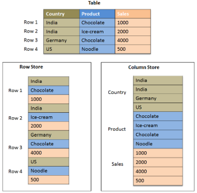

SUMMARY - Data Warehouse & Data Lake

### Data Warehouse
Merupakan sistem yang mengumpulkan data dari berbagai sumber ke dalam penyimpanan data tunggal, terpusat, dan konsisten untuk mendukung analisis data. Teknologi : AWS Redshift, Google Big Query, Clickhouse, Snowflake, Databricks, Apache Dorris, Postgre (with citus extension), etc.

### Data Lake
Merupakan gudang data tempat dikumpulkannya raw data yang nantinya akan di transform ke data warehouse.

### Data Warehouse VS Data Lake

### Postgresql Citus Extension
Citus merupakan extension open source untuk menjalankan Postgresql menjadi database terdistribusi. 

### Columnar Table

- Contoh penerapan di citus :
CREATE TABLE events_columnar ( device_id bigint, event_id bigserial, event_time timestamptz default now(), data jsonb not null) USING COLUMNAR ;

INSERT INTO events_columnar (device_id, data) SELECT d, '{"hello":"columnar"}' FROM generate_series(1, 10000000) d;

CREATE TABLE events_row AS SELECT * FROM events_columnar;

### Replication VS Sharding
1. Replication 
- data yang sama disalin di antara beberapa node
- digunakan untuk cadangan/ketersediaan tinggi

2. Sharding 
- data dibagi menjadi beberapa bagian dan didistribusikan ke beberapa node
- digunakan untuk pemrosesan/penyimpanan terdistribusi
- dapat menyimpan data lebih besar dari kapasitas node