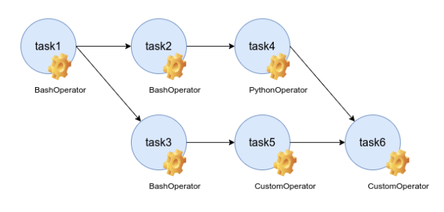

SUMMARY - Workflow Orchestration with Apache Wairflow

### Definisi Workflow
Merupakan sekumpulan tugas/task yang terhubung satu sama lain untuk mencapai tujuan tertentu. Masing-masing task akan dijalankan oleh sebuah operator.

### DAG (Directed Acyclic Graph)
Digunakan untuk menggambarkan sebuha workflow. Karakteristik DAG : 
- Hanya bersifat satu arah (acyclic)
- Bisa terdiri dari berbagai task dengan operator yang berbeda
- Satu task bisa melakukan percabangan ke task lain
- Berbagai task bisa menuju satu task yang sama
Contoh : 

### Apache Airflow
Merupakan tools yang dapat digunakan untuk mengelola workflow.

### Using XCOM in DAG (cross communication)
Memungkinkan pertukaran data antar task. 
- Cocok digunakan untuk data dengan ukuran kecil
- Tidak cocok untuk data dengan ukuran yang besar seperti sebuah DataFrame, file dan data lain
Contoh :

### Taskflow DAG
Dapat digunakan untuk membuat data pipeline di Airflow.