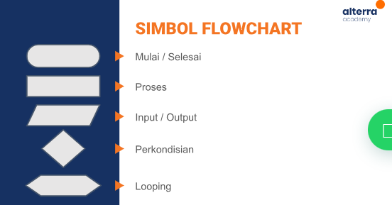

Rangkuman Materi Introduction Algorithm

## Definisi Algorithm
Prosedur komputasi yang didefinsikan dengan baik yang mengambil beberapa nilai sebagai inpit dan menghasilkan beberapa nilai sebagai output.

## Karakteristik Algorithm
- Memiliki batas (awal dan akhir), batas awal yaitu langkah pertama yang harus diambil serta batas akhir menunjukkan kapan algoritma selesai dijalankan / telah mencapai tujuan.
- Instruksi terdefinisi dengan baik
- Efektif dan efisien, Algoritma harus dirancang untuk menyelesaikan masalah dengan cara yang efektif dan efisien  tanpa melakukan langkah yang tidak perlu atau menghasilkan output yang tidak diperlukan.

## Algoritma Dasar
- *Sequential*, dijalankan secara berurutan tanpa melompat ke langkah lain di tengah jalan. 
- *Branching*, melibatkan pengambilan keputusan di tengah jalan algoritma, algoritma akan mengikuti jalan yang sesuai tergantung pada kondisi yang ditentukan. 
- *Looping*, melibatkan pengulangan sampai kondisi yang ditentukan terpenuhi/tercapai. 

## Definisi Pseudocode
Pseudocode adalah deskripsi informal dari algoritma menggunakan bahasa manusia sederhana untuk menjelaskan langkah-langkah dalam pemrograman.

## Flowchart
Flowchart merupakan suatu bagan dengan berbagai simbol yang menggambarkan suatu proses.

## Simbol Flowchart
