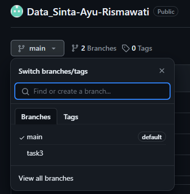

## Prioritas 1
- buatlah sebuah repository github yang sesuai dengan namaKelas_namaKalian.

- buatlah folder yang berurutan dan diberi nama sesuai dengan nama soal yang kalian kerjakan.

## Proritas 2
- membuat branch baru

- masuk ke branch baru