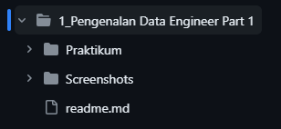
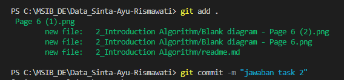

## Prioritas 1
- buatlah sebuah repository github yang sesuai dengan namaKelas_namaKalian.

  

- buatlah folder yang berurutan dan diberi nama sesuai dengan nama soal yang kalian kerjakan.

## Proritas 2
langkah-langkah yang saya lakukan :
- membuat branch dev di dalam branch main
- membuat branch feature1 dan feature2 di dalam branch dev
- menambahkan file baru pada branch feature1
](../Screenshots/image-5.png)

- melakukan git pull origin feature1 pada branch dev

setelahnya akan muncul pesan untuk melakukan pull request seperti berikut :

- Untuk itu, saya melakukan merge untuk update ke branch main

branch main telah terupdate
