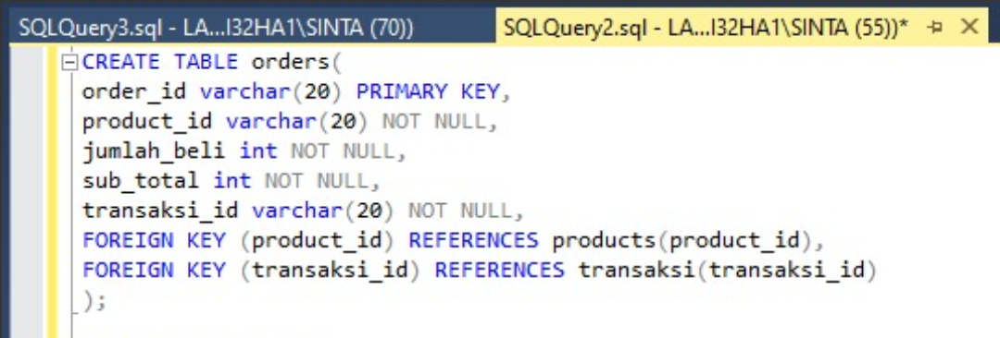
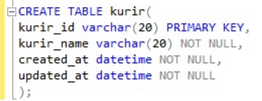
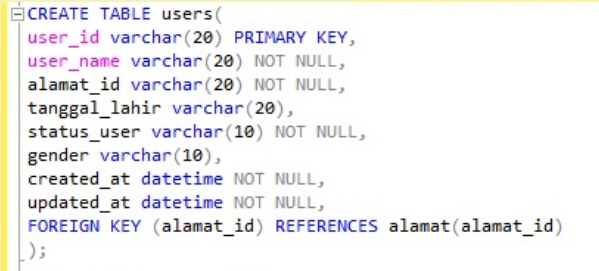

## 1. Create database alta_online_shop.

## 2. Dari schema Olshop yang telah kamu kerjakan di, Implementasikanlah menjadi table pada MySQL.
    ### 1. Create table user
    ### 2. Create table product, product type, operators, product description, payment_method.
    ### 3. Create table transaction, transaction detail.
    #### Jawaban :
    
    
    

## 3. Create tabel kurir dengan field id, name, created_at, updated_at.

## 4. Tambahkan ongkos_dasar column di tabel kurir.

## 5. Rename tabel kurir menjadi shipping.

## 6. Hapus / Drop tabel shipping karena ternyata tidak dibutuhkan.

## 7. Silahkan menambahkan entity baru dengan relation 1-to-1, 1-to-many, many-to-many. Seperti:
    ### a.) 1-to-1: payment method description.
    

    ### b.) 1-to-many: user dengan alamat.
    

    ### c.) many-to-many: user dengan payment method menjadi user_payment_method_detail.
    