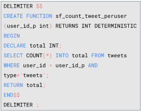

SUMMARY - RELATION DATABASE

# Apa itu database?
Database adalah sekumpulan data yang terorganisir

# Schema database
terdiri dari entity dan atribute

# Database Relationship
## 1. One to One
Ex : 1 user hanya memiliki 1 profil

## 2. One to Many
Ex : 1 user bisa memiliki banyak tweets

## 3. Many to Many
Ex : 
- 1 user bisa memiliki banyak follower, 1 user bisa di follow banyak user
- 1 mahasiswa bisa memiliki banyak mata kuliah, 1 mata kuliah bisa diambil oleh banyak mahasiswa 

# Jenis Perintah SQL
## 1. DDL (Data Definition Language)
Ex : 
- CREATE DATABASE db_name;
- USE db_name;
- CREATE TABLE tbl_name(
    column1 typedata PRIMARY  KEY,
    column2 typedata,
    FOREIGN KEY (column2) REFERENCES tbl_2(column1)
);
- DROP TABLE tbl_name;
- RENAME TABLE tbl_name to new_tbl_name;
- ALTER TABLE tbl_name
ADD COLUMN column_name datadtype;

## 2. DML (Data Manipulation Language)
Merupakan perintah yang digunakan untuk memanipulasi data dalam tabel dari suatu database.
### a.) STATEMENT OPERATION (INSERT, SELECT, UPDATE, DELETE). Ex : 
- INSERT INTO users (username, fullname) VALUES ('Sinta', 'Sinta Ayu')
- SELECT*FROM users;
- SELECT username FROM users WHERE id=1;
- UPDATE users SET fullname = 'Rismawati' WHERE id=1;
- DELETE FROM users WHERE id = 1;

### b.) DML Statement (LIKE/BETWEEN, AND/OR, ORDER BY, LIMIT). Ex :
- SELECT user_id FROM tweets WHERE message LIKE 'H%' ;
- SELECT user_id, message FROM tweets WEHERE user_id BETWEEN 1 AND 3 ;
- SELECT user_id FROM tweets WHERE message LIKE 'H%' OR user_id BETWEEN 1 AND 3 ;
- SELECT*FROM tweets ORDER BY id DESC;
- SELECT*FROM tweets ORDER BY id DESC LIMIT 2;

### c.) JOIN
Merupakan sebuah klausa untuk mengkombinasikan record dari 2 atau lebih lebih. Join Standar SQL :
- INNER JOIN, ex :
{
    SELECT Orders.OrderID, Customers.CustomerName
    FROM Orders
    INNER JOIN Customers ON Orders.CustomerID = Customers.CustomerID;
}

- LEFT JOIN, ex :
{
    SELECT Orders.OrderID, Customers.CustomerName
    FROM Orders
    LEFT JOIN Customers ON Orders.CustomerID = Customers.CustomerID;
}

- RIGHT JOIN, ex :
{
    SELECT Orders.OrderID, Customers.CustomerName
    FROM Orders
    RIGHT JOIN Customers ON Orders.CustomerID = Customers.CustomerID;

}

### d.) UNION
Jumlah field yang dikeluarkan/dipanggil harus sama. Ex :
{
    SELECT username FROM users WHERE id = 1
    UNION
    SELECT username FROM users WHERE id = 2
}

### c.) Agregasi SQL
- MIN, ex :
SELECT MIN(id) AS id FROM users;

- MAX, ex :
SELECT MAX(id) AS id FROM users;

- SUM, ex :
SELECT SUM(Favourite_count) FROM tweets WHERE user_id=1 ;

- AVG, ex : 
SELECT AVG(Favourite_count) FROM tweets WHERE user_id=1 ;

- COUNT, ex :
SELECT COUNT(1) FROM tweets WHERE user_id =1 ;

- HAVING, ex :
SELECT user_id FROM tweets GROUP BY user_id HAVING SUM(favourite_count) > 2;

### d.) Subquery, Ex :
SELECT*FROM users WHERE id IN (SELECT user_id FROM tweets GROUP BY user_id);

### e.) Function, Ex :

## 3. DCL (Data Control Language)
- GRANT, ex :
GRANT SELECT, INSERT ON table_name TO user_name;

- REVOKE, ex :
REVOKE SELECT ON table_name FROM user_name;

- COMMIT, ex :
COMMIT;

- ROLLBACK, ex :
ROLLBACK;

- SAVEPOINT, ex :
SAVEPOINT savepoint_name;